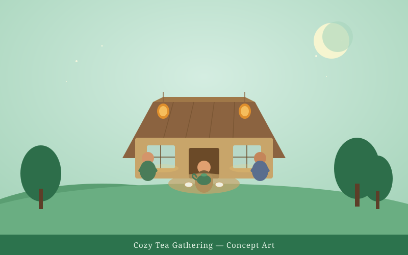
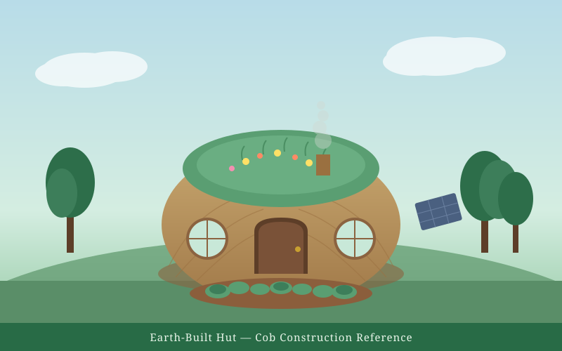
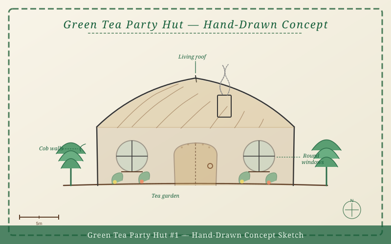

# ⚸ 🍵 🫖🦧 🛖 🦚📜🧞‍♂️
## Green Tea Hut #1 — Public Accountability Ledger
The Green Tea Party's first project, Green Tea Hut #1. 

Project funding and spending are tracked alongside milestone progress and displayed publicly for donors, sponsors, and fans to follow along with where their energy and attention is going.

- Campaign page: https://artizen.fund/index/p/green-tea-hut-1?season=7
- Public ledger (GitHub Pages): _coming online_

---

## 🖼️ Project Visuals

These concept images tell the story of what we're building — a cozy, earth-built gathering space for community, ceremony, and tea. Every dollar raised and spent appears in the [public ledger](web/index.html) so you can trace how these visions become reality.

| | | |
|:---:|:---:|:---:|
|  |  |  |
| **Cozy Tea Gathering** — The warmth and spirit we're creating | **Earth-Built Hut** — Cob construction with a living roof | **Hand-Drawn Concept** — Our sketch-to-build vision |

These images are directly connected to our accountability ledger. As materials are purchased, labor is logged, and milestones are hit, every step is recorded with proof links — so supporters can watch concept art become constructed reality.

---

### Goals
1. Transparent accounting
2. Traceable spending by milestone
3. Public proof links (receipts/photos/docs)
4. Ongoing monthly updates
